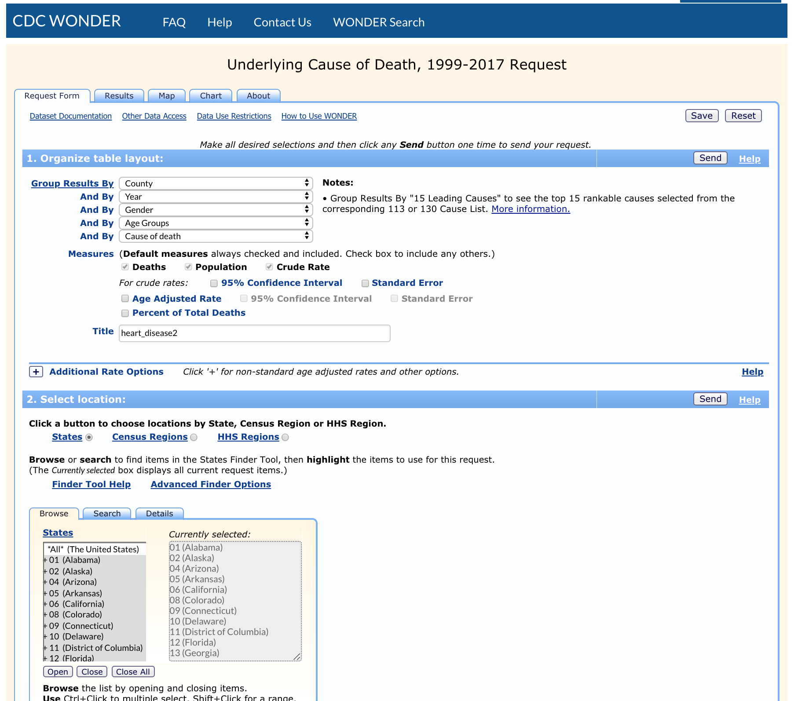
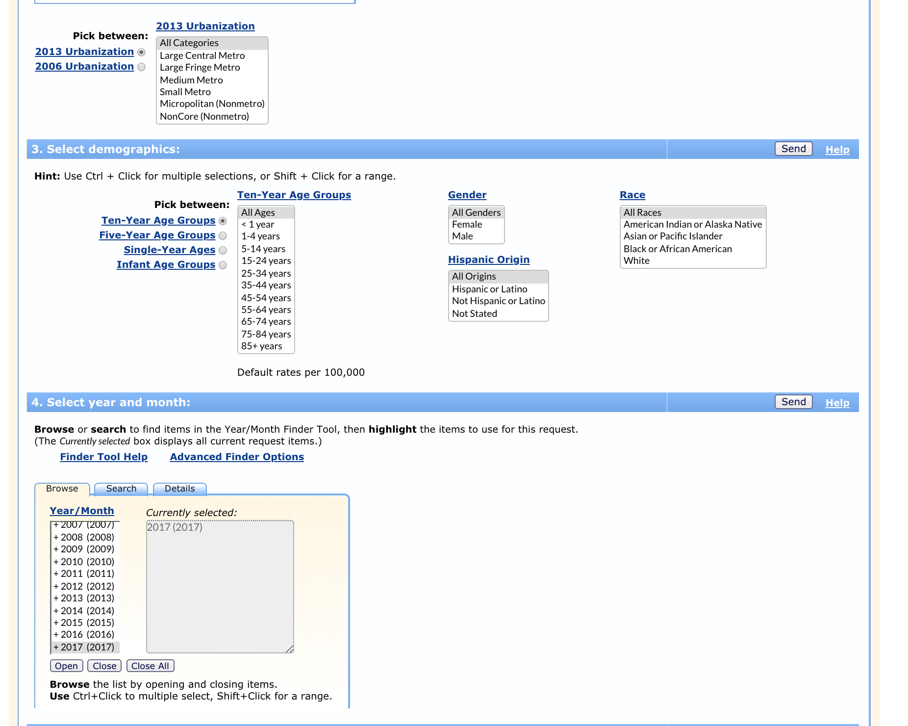
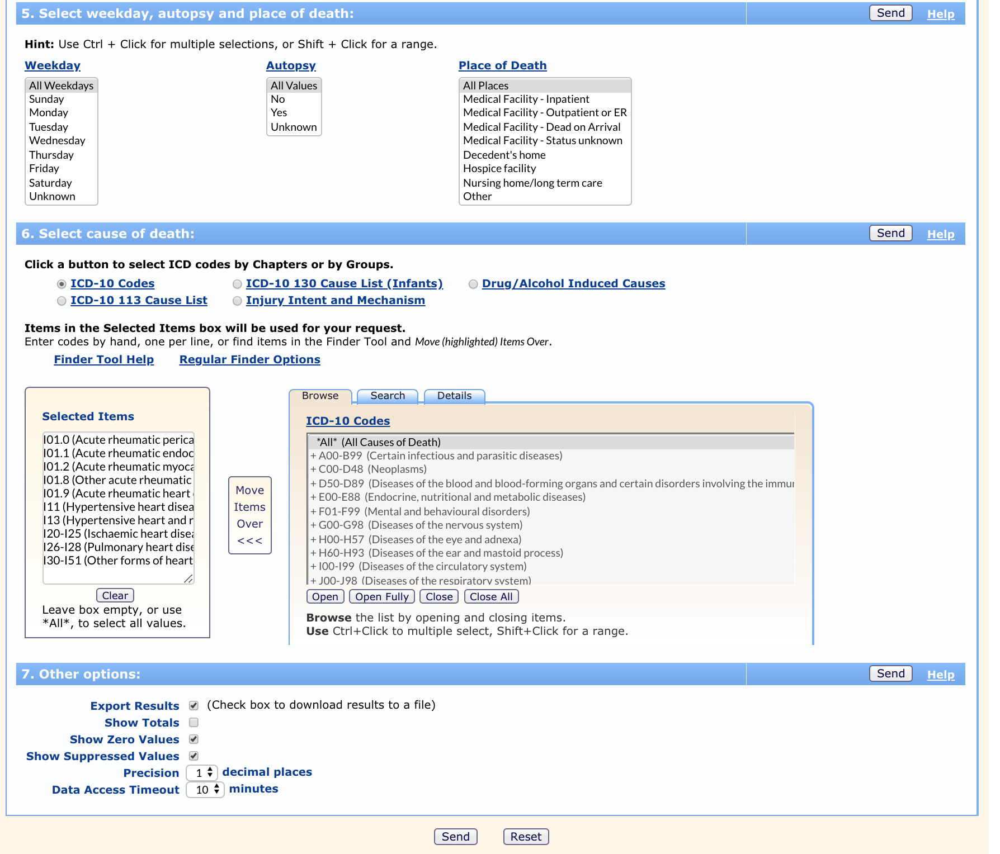

## Deaths from Heart Disease 2008-2017

## _Table of Contents_
 - [Data Source](#datasource)
 - [ICD-10 codes chosen for data retrieval](#ICDcodes)
 - [Data processing post extraction](#postextract)
 - [How data was aquired](#howdata)  
 - [Processing the data extracted from Wonder](#processdata)

<a id="datasource"></a>
### _Data Source:_
_Centers for Disease Control and Prevention, National Center for Health Statistics.  
Underlying Cause of Death 1999-2017 on CDC WONDER Online Database, released December, 2018._  

Data are from the Multiple Cause of Death Files, 1999-2017, as compiled from data provided by the 57 vital statistics jurisdictions through the Vital Statistics Cooperative Program. Accessed at http://wonder.cdc.gov/ucd-icd10.html.

See also http://wonder.cdc.gov/wonder/help/ucd.html for more information.

__Data selected for years:__ 2008 - 2017  
__Group By:__ County, Year, Gender, Ten-Year Age Groups, Cause of death

<a id="ICDcodes"></a>
### _ICD-10 codes chosen for data retrieval:_
I01.0 Acute rheumatic pericarditis  
I01.1 Acute rheumatic endocarditis  
I01.2 Acute rheumatic myocarditis  
I01.8 Other acute rheumatic heart disease  
I01.9 Acute rheumatic heart disease, unspecified  
I11.0 Hypertensive heart disease with (congestive) heart failure  
I11.9 Hypertensive heart disease without (congestive) heart failure  
I13.0 Hypertensive heart and renal disease with (congestive) heart failure  
I13.1 Hypertensive heart and renal disease with renal failure  
I13.2 Hypertensive heart and renal disease with both (congestive) heart failure and renal failure   
I13.9 Hypertensive heart and renal disease, unspecified  
I20-I25 Ischaemic heart diseases  
I26-I28 Pulmonary heart disease and diseases of pulmonary circulation  
I30-I51 Other forms of heart disease  

The heart disease codes above were chosen as suggested by: [NCHS ICD-10 Rankable Causes (Leading Causes)](https://www.ehdp.com/epigram/nchs-icd-10-lcd.htm)

<a id="postextract"></a>
### _Data processing post extraction:_
The _CDC Wonder_ tool only allows for the processing of 75,000 data rows at a time. The data was extracted by years and in segments of states to meet this limitation.  The result is 43 data tables. The data is parsed into a single csv file.

<a id="howdata"></a>
### _How data was aquired_

As identified in the sources section at top, the data was aquired using the CDC WONDER Online Database. Screen shots below show the setup.

<div style="width: 800px;">[ScreenShot1.png](images/ScreenShot1.png)</div>

<div style="width: 800px;">[ScreenShot2.png](images/ScreenShot2.png)</div>

<div style="width: 800px;">[ScreenShot3.png](images/ScreenShot3.png)</div>


<a id="processdata"></a>
### _Processing the data extracted from Wonder_

file_parser.py

```python
file_prefix = "data/heart_disease/data-raw/heart_disease2 ("
file_suffix = ").txt"
for file_num in range(42):
    if (file_num == 2) or (file_num == 17):  # skip duplicate sets that were double downloaded
        continue
    file_name = file_prefix + str(file_num) + file_suffix
    fileObj = open(file_name,'r')
    if file_num == 0:
        fileOutObj = open("data/heart_disease/data/heart_disease_all.csv","w")
        header = 'County,State,County Code,Year,Year Code,Gender,Gender Code,Ten-Year Age Groups,Ten-Year Age Groups Code,Cause of death,Cause of death Code,Deaths,Population,Crude Rate\n'
        fileOutObj.write(header)
    cntr = 0
    for line in fileObj:
        outStr = ""
        if line[1:5] != 'Note':
            if line[1:4] == '---':
                break
            line = line.replace('"', '').strip()    # remove all the quotes
            line = line.replace(' County, ', ',').strip() # remove County
            # lines below remove the odd places where a comma appears in the cause of death field
            line = line.replace(', valve', ' - valve').strip()
            line = line.replace(', un', ' - un').strip()
            line = line.replace(', so', ' - so').strip()
            line = line.replace(', ', ',').strip()  # replace all comma space with comma
            line = line.replace('\t', ',').strip()  # replace all tabs with comma
            # AK,DC,LA,MD,WV,VA are states that have some or no 'County' designation
            outStr =line+'\n'
            fileOutObj.write(outStr)
            cntr += 1
    print(cntr, 'records parsed in dataset: ' + file_name)
fileOutObj.close()
fileObj.close()


```
_Output:_

    2918 records parsed in dataset: data/heart_disease/data-raw/heart_disease2 (0).txt
    2495 records parsed in dataset: data/heart_disease/data-raw/heart_disease2 (1).txt
    3367 records parsed in dataset: data/heart_disease/data-raw/heart_disease2 (3).txt
    1661 records parsed in dataset: data/heart_disease/data-raw/heart_disease2 (4).txt
    1574 records parsed in dataset: data/heart_disease/data-raw/heart_disease2 (5).txt
    3299 records parsed in dataset: data/heart_disease/data-raw/heart_disease2 (6).txt
    2412 records parsed in dataset: data/heart_disease/data-raw/heart_disease2 (7).txt
    2848 records parsed in dataset: data/heart_disease/data-raw/heart_disease2 (8).txt
    2925 records parsed in dataset: data/heart_disease/data-raw/heart_disease2 (9).txt
    3030 records parsed in dataset: data/heart_disease/data-raw/heart_disease2 (10).txt
    2934 records parsed in dataset: data/heart_disease/data-raw/heart_disease2 (11).txt
    1350 records parsed in dataset: data/heart_disease/data-raw/heart_disease2 (12).txt
    1349 records parsed in dataset: data/heart_disease/data-raw/heart_disease2 (13).txt
    3576 records parsed in dataset: data/heart_disease/data-raw/heart_disease2 (14).txt
    1894 records parsed in dataset: data/heart_disease/data-raw/heart_disease2 (15).txt
    3349 records parsed in dataset: data/heart_disease/data-raw/heart_disease2 (16).txt
    3372 records parsed in dataset: data/heart_disease/data-raw/heart_disease2 (18).txt
    2652 records parsed in dataset: data/heart_disease/data-raw/heart_disease2 (19).txt
    2900 records parsed in dataset: data/heart_disease/data-raw/heart_disease2 (20).txt
    1348 records parsed in dataset: data/heart_disease/data-raw/heart_disease2 (21).txt
    1395 records parsed in dataset: data/heart_disease/data-raw/heart_disease2 (22).txt
    3669 records parsed in dataset: data/heart_disease/data-raw/heart_disease2 (23).txt
    2416 records parsed in dataset: data/heart_disease/data-raw/heart_disease2 (24).txt
    3028 records parsed in dataset: data/heart_disease/data-raw/heart_disease2 (25).txt
    3063 records parsed in dataset: data/heart_disease/data-raw/heart_disease2 (26).txt
    2612 records parsed in dataset: data/heart_disease/data-raw/heart_disease2 (27).txt
    3206 records parsed in dataset: data/heart_disease/data-raw/heart_disease2 (28).txt
    1635 records parsed in dataset: data/heart_disease/data-raw/heart_disease2 (29).txt
    1690 records parsed in dataset: data/heart_disease/data-raw/heart_disease2 (30).txt
    3675 records parsed in dataset: data/heart_disease/data-raw/heart_disease2 (31).txt
    2342 records parsed in dataset: data/heart_disease/data-raw/heart_disease2 (32).txt
    3108 records parsed in dataset: data/heart_disease/data-raw/heart_disease2 (33).txt
    3163 records parsed in dataset: data/heart_disease/data-raw/heart_disease2 (34).txt
    2618 records parsed in dataset: data/heart_disease/data-raw/heart_disease2 (35).txt
    3041 records parsed in dataset: data/heart_disease/data-raw/heart_disease2 (36).txt
    1847 records parsed in dataset: data/heart_disease/data-raw/heart_disease2 (37).txt
    1944 records parsed in dataset: data/heart_disease/data-raw/heart_disease2 (38).txt
    3460 records parsed in dataset: data/heart_disease/data-raw/heart_disease2 (39).txt
    2371 records parsed in dataset: data/heart_disease/data-raw/heart_disease2 (40).txt
    3148 records parsed in dataset: data/heart_disease/data-raw/heart_disease2 (41).txt

